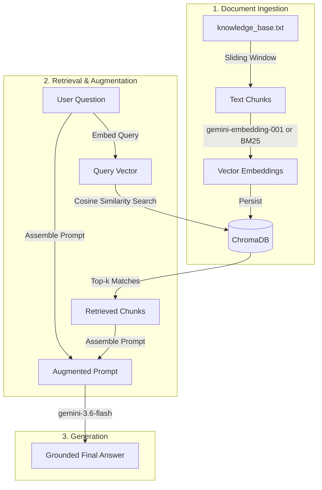

# 🤖 MyFirstRAG - End-to-End Retrieval-Augmented Generation

[](https://www.python.org/downloads/)
[](https://www.trychroma.com/)
[](https://ai.google.dev/)
[](LICENSE)

An educational, modular, and production-patterned **Retrieval-Augmented Generation (RAG)** system built in Python.

This project demonstrates how Large Language Models (LLMs) can be grounded with custom domain knowledge (the *NovaTech Dynamics Internal Handbook*) using vector similarity search, preventing hallucinations and ensuring factual responses.

---

## 📑 Table of Contents

- [Overview & Architecture](#-overview--architecture)
- [Project Structure](#-project-structure)
- [How the Pipeline Works](#-how-the-pipeline-works)
- [Quick Start](#-quick-start)
  - [Prerequisites](#prerequisites)
  - [Installation](#installation)
  - [Configuration](#configuration)
- [Usage](#-usage)
  - [1. Interactive CLI Console](#1-interactive-cli-console)
  - [2. Automated Benchmark Test Suite](#2-automated-benchmark-test-suite)
- [Key Features](#-key-features)
- [License](#-license)

---

## 🧠 Overview & Architecture

Retrieval-Augmented Generation (RAG) bridges the gap between static LLM training data and your private, rapidly changing documents. Instead of fine-tuning, RAG retrieves relevant document passages at query time and presents them to the LLM as context.



---

## 📁 Project Structure

```text
myFirstRAG/
├── data/
│   └── knowledge_base.txt      # Custom facts & policies (NovaTech Handbook)
├── src/
│   ├── __init__.py             # Package marker
│   ├── chunker.py              # Sliding-window document chunking with overlap
│   ├── embeddings.py           # Dual-mode embeddings (Gemini API & local BM25/TF-IDF)
│   ├── vector_store.py         # ChromaDB client, indexing, and similarity search
│   ├── generator.py            # Context-augmented prompt assembly & LLM generation
│   └── rag_pipeline.py         # End-to-end orchestrator pipeline
├── .env.example                # Configuration template
├── .gitignore                  # Git ignore rules (secrets, venv, Chroma storage)
├── LICENSE                     # MIT License
├── main.py                     # Interactive terminal console
├── requirements.txt            # Project dependencies
└── test_rag.py                 # Automated benchmark test suite
```

---

## ⚙️ How the Pipeline Works

1. **Chunking (`src/chunker.py`)**:
   Splits large documents into overlapping passages (default: 500 characters, 100 character overlap) so sentences spanning across boundaries are not lost.
2. **Embedding (`src/embeddings.py`)**:
   Converts chunks into dense mathematical vectors.
   - **Online Mode:** Uses Google Gemini `gemini-embedding-001` via the official `google-genai` SDK.
   - **Offline Mode:** Seamless fallback to an offline BM25/TF-IDF vectorizer if no API key is provided.
3. **Vector Database (`src/vector_store.py`)**:
   Stores vector representations and raw text in a persistent ChromaDB collection (`novatech_knowledge`) using Cosine similarity.
4. **Augmentation (`src/generator.py`)**:
   Formats retrieved passages into a structured system prompt with strict guardrail instructions ("*Answer strictly using the provided context. If the answer cannot be deduced, state that clearly.*").
5. **Generation (`src/generator.py`)**:
   Calls `gemini-3.6-flash` to synthesize a concise, factual answer grounded in the retrieved passages.

---

## 🚀 Quick Start

### Prerequisites

- Python 3.9 or higher
- Git

### Installation

1. **Clone the repository:**
   ```bash
   git clone https://github.com/Srivathsa1312/myFirstRAG.git
   cd myFirstRAG
   ```

2. **Create and activate a virtual environment:**
   ```bash
   # Windows (PowerShell)
   python -m venv .venv
   .\.venv\Scripts\Activate.ps1

   # Linux / macOS
   python3 -m venv .venv
   source .venv/bin/activate
   ```

3. **Install dependencies:**
   ```bash
   pip install -r requirements.txt
   ```

### Configuration

Copy `.env.example` to `.env` and insert your [Google Gemini API Key](https://aistudio.google.com/):

```bash
cp .env.example .env
```

Edit `.env`:
```env
GEMINI_API_KEY=your_actual_gemini_api_key_here
```

> **Note:** If no API key is provided, the system automatically falls back to offline educational mode with local TF-IDF embeddings and heuristic extraction.

---

## 💻 Usage

### 1. Interactive CLI Console

Launch the interactive console to test questions in real time:

```bash
python main.py
```

**Example interaction:**
```text
=================================================================
         🤖 Welcome to MyFirstRAG Interactive Console
=================================================================
Ask any question about NovaTech Dynamics (policies, hardware,
Project Chimera, incident response, or out-of-domain topics).
Type 'exit' or 'quit' to stop.

❓ Your Question: What is the remote work policy and stipend?

🔎 Searching vector database & generating answer...

------------------------------------------------------------
📥 RETRIEVED CHUNKS (2 matches):
------------------------------------------------------------
Chunk #1 [Similarity: 0.8142]:
"All NovaTech employees are eligible for the 'Work-From-Anywhere-Quarter' program.
Under this policy, employees may work from any approved international location for
up to 90 days per calendar year. NovaTech provides a monthly internet and co-working
stipend of $350 USD..."

------------------------------------------------------------
🎯 FINAL ANSWER (via gemini-3.6-flash):
------------------------------------------------------------
Employees can participate in the 'Work-From-Anywhere-Quarter' program to work
internationally for up to 90 days per calendar year. NovaTech provides a monthly
stipend of $350 USD for internet and co-working spaces.
------------------------------------------------------------
```

### 2. Automated Benchmark Test Suite

Run the automated test suite to verify retrieval accuracy, similarity scores, and out-of-domain guardrail handling:

```bash
python test_rag.py
```

**Benchmark Results:**
```text
==================================================
          🧪 RUNNING RAG SYSTEM TEST SUITE        
==================================================
[Embedding] Using Google Gemini 'gemini-embedding-001'

[Test #1] In-Domain: Policy
Question: "What is the pet policy at NovaTech?"
Top Match Similarity: 0.7710
 Result:  PASS (Expected information was successfully retrieved)

[Test #2] In-Domain: Project Details
Question: "Who is leading Project Chimera and what is the architecture?"
Top Match Similarity: 0.7420
 Result:  PASS (Expected information was successfully retrieved)

[Test #3] In-Domain: Security Incident
Question: "What terminal command must be executed during a credential leak?"
Top Match Similarity: 0.7455
 Result:  PASS (Expected information was successfully retrieved)

[Test #4] Out-of-Domain: External Topic
Question: "What is the capital of France and its GDP?"
Top Match Similarity: 0.5054
 Result:  PASS (Handled out-of-domain query)

==================================================
TEST SUMMARY: 4/4 Passed (100%)
==================================================
```

---

## ✨ Key Features

- **Dual Embedding Architecture**: Zero-config offline mode with seamless upgrade to state-of-the-art Google Gemini embeddings.
- **Persistent Vector Storage**: Uses ChromaDB disk persistence, avoiding costly re-indexing on every run.
- **Strict Hallucination Guardrails**: Prompts engineered to refuse out-of-domain queries when evidence is absent.
- **Zero-Crash Fallback**: Gracefully handles network issues, API quota limits, and missing configurations.
- **Comprehensive Test Suite**: Automated verification of semantic relevance and keyword containment.

---

## 📄 License

This project is licensed under the [MIT License](LICENSE).
